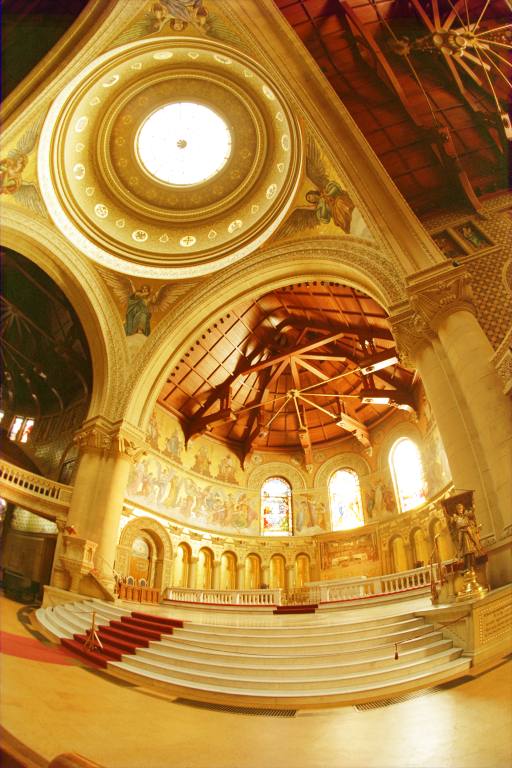
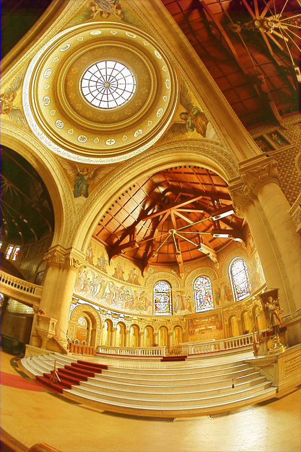
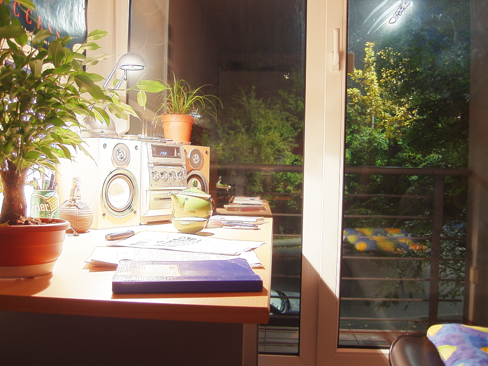

# High Dynamic Range Imaging
* Given a series of photographs for a scene under different exposures, output an HDR image and, optionally, the response curve of the camera.
* With the responsive function, we can reconstruct the radinace map and output it as a Radiance RGBE image (.hdr)
* Finally, tone map the radiance map (HDR) to a low dynamic range (LDR) image.
## Usage
### Data Preparation (Optional)
  * Place your images of different exposure times under `$INDIR`
  * Run the following command, which will automatically read the exposure times of images under `$INDIR` and create `exposure_times.csv`

    ```bash
    python3 read_exposure.py $INDIR
    # E.g., 
    # python3 read_exposure.py ./data/team26_2
    ```
### Running the Code
* Command
    ```bash
    python main.py [--indir $INDIR] [--outdir $OUTDIR] [-d $DEPTH] 
    [-w $WEIGHTING_FUNCTION] [--lamb $LAMBDA] [--alpha $ALPHA] 
    [--gamma $GAMMA] [--tm $TONEMAPPING_METHOD] 
 
    # E.g.,
    # python3 main.py --indir ./data/team26_2 --outdir ./data
    ```
 
## 1. Image Alignment (MTB Algorithm)
* Align all images before further processing.
  |  | w/o alignment | w/ alignment (d=10)|
  |--|-----------|---------|
  |team26_2||

## 2. HDR Reconstruction (Debevec's Method):
* Reference : [Recovering high dynamic range radiance maps from photographs](https://dl.acm.org/doi/10.1145/258734.258884)
* Combine the aligned images to recover the scene's radiance map.
  * By rewriting the objective $O$ into the form of $Ax=b$, we can solve $x = [g(0) \dots g(255) \ lnE_1 \dots lnE_n]^T$, getting $g$ such that $g(Z_{ij}) = ln(X_{ij})$
  $$O = \sum_{i=1}^{N} \sum_{j=1}^{P} {w(Z_{ij}) [g(Z_{ij}) - ln E_i - ln \Delta t_j]}^2 + \lambda \sum_{z=Zmin+1}^{Zmax-1} [w(z)g''(z)]^2
  $$ 
* Recover HDR Radiance map by Camera Response Function
  * With $g$, we can compute the radiance of each pixel $i$ based on
  $$E_i = e^{\frac{{\Sigma_{j=1}^{P}{w(Z_{ij})(g(Z_{ij}) - ln \Delta t_j)}}}{\Sigma_{j=1}^{P}w(Z_{ij})}}
  $$

## 3. Tone Mapping
* Reference : [Photographic Tone Reproduction for Digital Images](https://dl.acm.org/doi/10.1145/566654.566575)
* Global and Local operators (dodging and burning) are implemented to converts the HDR image into a LDR image suitable for displaying on standard monitors.

* Global Method
  $$\overline L_w=e^{[\frac1N \Sigma_{x,y}log(\delta + L_w(x, y))]}$$
  $$L_m(x, y) = \frac{\alpha}{\overline L_w}L_w(x, y)$$
  $$\rightarrow L_d(x, y) = \frac{L_m(x, y)(1+\frac{L_m(x, y)}{{L_{white}(x, y)}^2})}{1+L_m(x, y)}$$
* Local Method
  $$V_i^{blur}(x, y, s) = L_m(x, y) \otimes G_s(x, y, s)$$
  $$V_s(x, y, s) = \frac{V_1^{blur}(x, y, s) - V_{2}^{blur}(x, y, s)}{2^{\phi} \frac{\alpha}{s^2}+V_1^{blur}},  s_{max} \ni |V_{s_{max}}(x, y) < \epsilon|$$
  $$\rightarrow L_d(x, y)=\frac{L_m(x, y)}{1+V_1^{blur} \left( x, y, s_{max}(x, y) \right)}$$
  

- Comparisons of global and local methods

  |  | Global | Local |
  |--|--------|-------|
  |testcase_1|||
  |testcase_2|||
